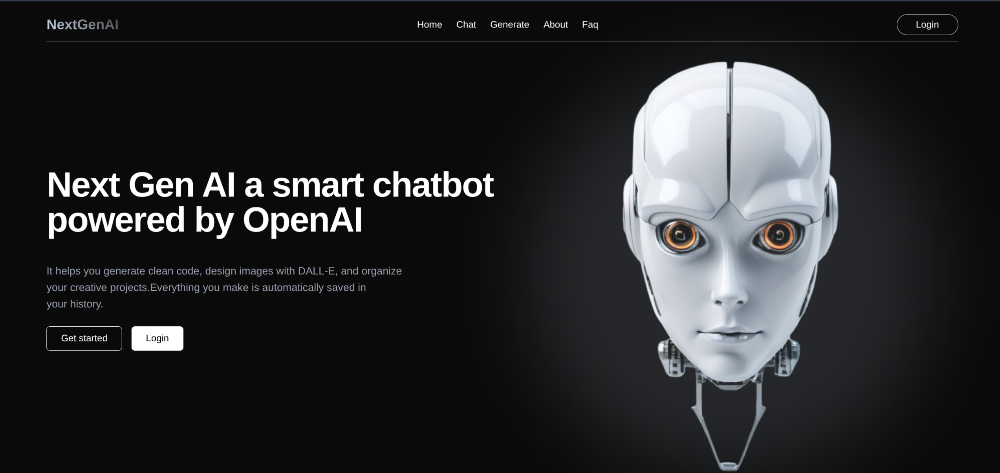

# Nextgen Agentic AI



> **NextGen Agentic AI** is a modern full-stack web application featuring a sleek React/Vite frontend, secure authentication, and a responsive UI designed for interacting with autonomous AI agents.

## Features

- **Blazing Fast Frontend**: Built with React, TypeScript, and Vite.
- **Modern UI**: Styled with Tailwind CSS for a fully responsive and elegant design.
- **Landing Page**: An engaging hero section to introduce the AI agent's capabilities.
- **Authentication**: Built-in Register and Login flows for secure user access.
- **Chat History**: Keep track of interactions with the autonomous AI agent.

## Getting Started

### Prerequisites
- Node.js (v18+ recommended)
- npm or yarn

### Installation
1. Clone the repository
   ```bash
   git clone https://github.com/your-username/Nextgen_AI_agent.git
   cd Nextgen_AI_agent
   ```

2. Install dependencies
   ```bash
   npm install
   ```

3. Start the development server
   ```bash
   npm run dev
   ```

## Tech Stack
- React
- TypeScript
- Vite
- Tailwind CSS

## Contributing
Contributions are welcome! Please open an issue or submit a pull request for any new features or bug fixes.
